# Actividad cuatro - Mi primer portafolio web con Bootstrap.
## Se creo un portafolio basándose en una plantilla de Bootstrap.
Todo lo anterior se va a documentar en GitHub (un README) y se publicara en Pages siguiendo la siguiente estructura:
***
#### Elaborado por: David Efraín José Ramos NL 19
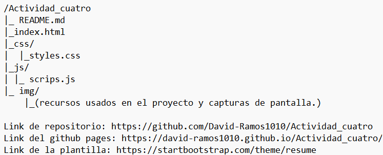
## Descripción breve:
En lo personal yo descargue una plantilla basada en Bootstrap desde la pagina de https://startbootstrap.com/themes/portfolio-resume donde hay muchos portafolios que puedes usar gratis para un proyecto personal.
Yo en lo personal elegí una plantilla sencilla, la cual es:
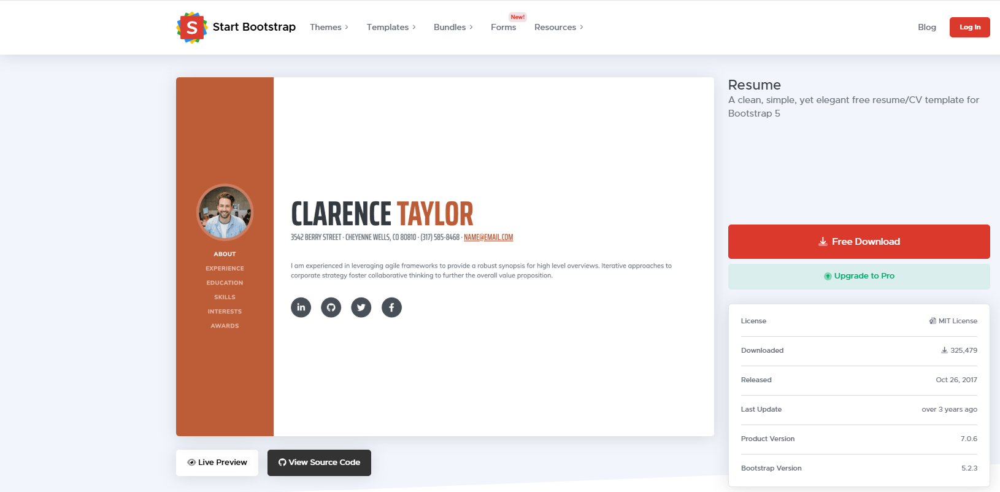
***
### Partes de la platilla sin modificar:
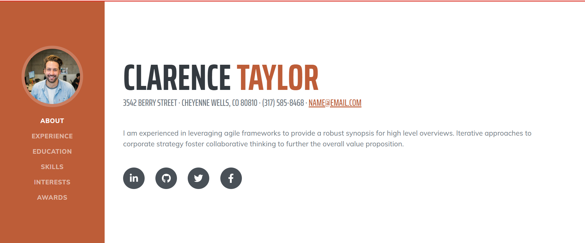
La platilla estaba en ingles con las siguientes secciones en ingles: ABOUT, EXPERIENCE, EDUCATION, SKILLS, INTERESTS y AWARDS. Ademas de eso la paleta de colores era principalmente blanca, anaranjada y amarilla.
Las modificaciones que realice fueron porque quería diferenciarme de las otras dos plantillas repetidas por mis compañeros. 
### Modificaciones:
Las modificaciones que hice en el portafolio fueron más sobre el css.
Modifiqué la paleta ayudándome de una página web donde obtuve el código rgba y hexadecimal. 
https://www.rapidtables.com/web/color/RGB_Color.html
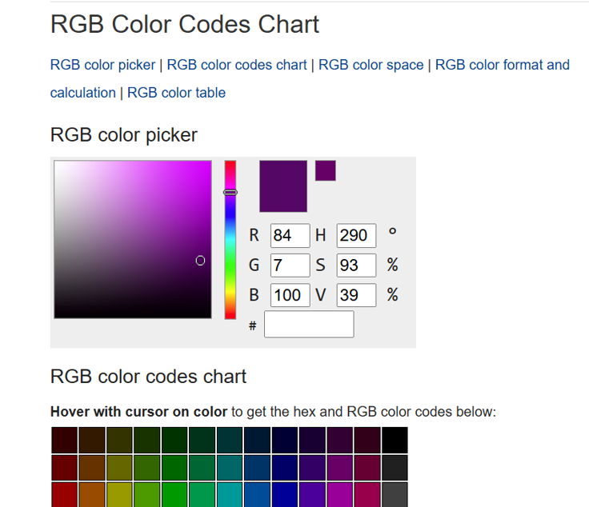

Con ayuda del panel de desarrollador identifique que elementos debía modificar.
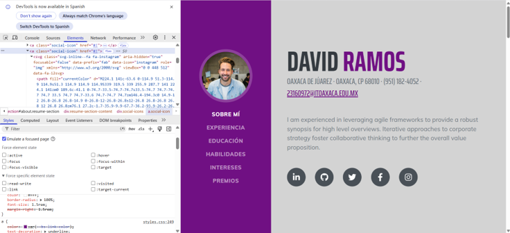

También modifique el root del css.
Como estuve buscando en más de diez mil líneas de código me ayudé mucho del buscador para buscar los elementos.
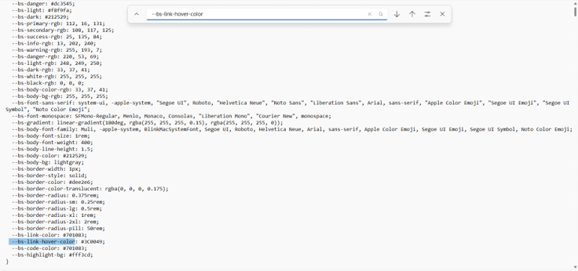

La parte donde mas tuve problemas al modificar el archivo de estilos fue cambiar el hover de los iconos.
```css
.social-icons .social-icon {
  display: inline-flex;
  align-items: center;
  justify-content: center;
  height: 3.5rem;
  width: 3.5rem;
  background-color: #495057;
  color: #fff;
  border-radius: 100%;
  font-size: 1.5rem;
  margin-right: 1.5rem;
}
.social-icons .social-icon:last-child {
  margin-right: 0;
}
.social-icons .social-icon:hover {
  background-color: #540764;
}

.dev-icons {
  font-size: 3rem;
}
```
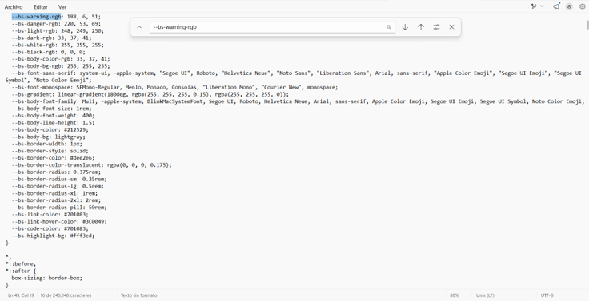
### Modificaciones en el html.
En el HTML solo añadí mis datos dentro de sus etiquetas y clases correspondientes. 
Me gusto mucho que el Bootstrap ya tenia iconos por defecto y solo tenias que llamarlas. Por ejemplo 
```html
<!--Solo cambia 'instagram' por cualquier red social-->
<a class="social-icon" href="https://www.instagram.com/"><i class="fab fa-instagram"></i></a> 
```


Lo mismo pasa al añadir lenguajes de programación en "Habilidades". Por ejemplo:
```html
<!--Solo cambia 'php' por cualquier lenguaje de programación-->
<li class="list-inline-item"><i class="fab fa-php"></i></li> 
```

### Captura de pantallas
#### Corriendo en local
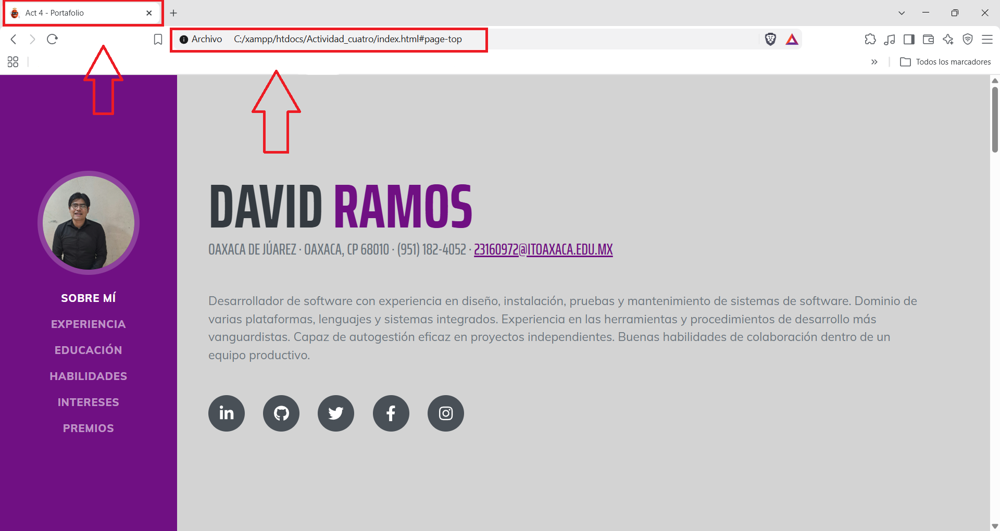
#### Corriendo en pages
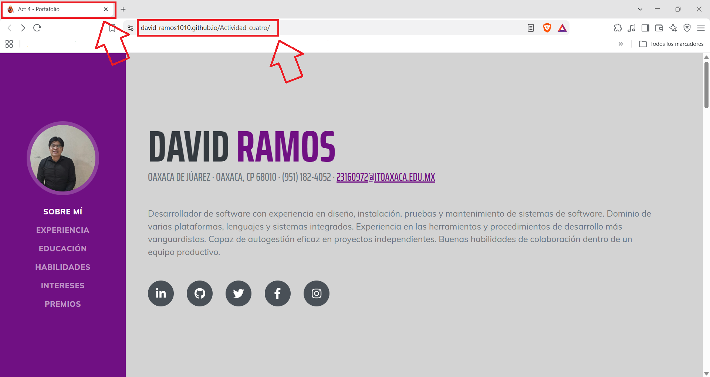
#### Sección de experiencia
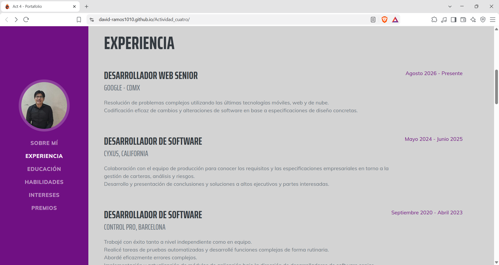
#### Sección de educación
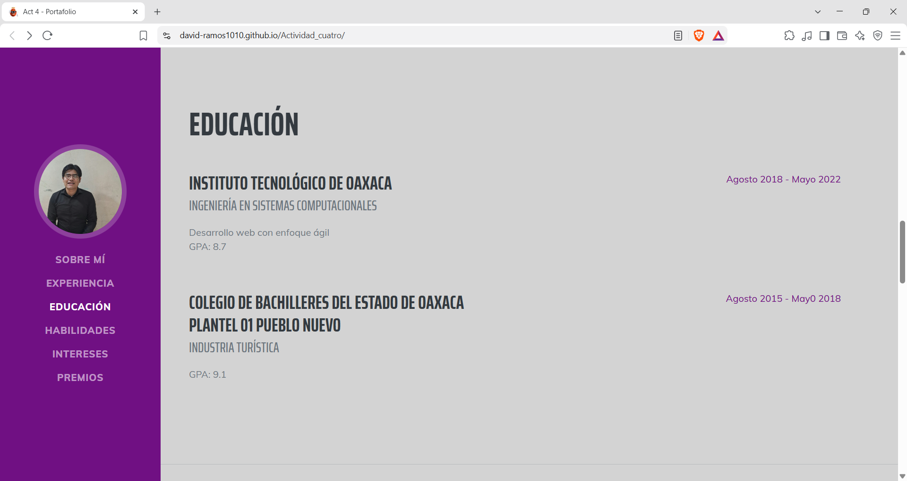
#### Sección de habilidades
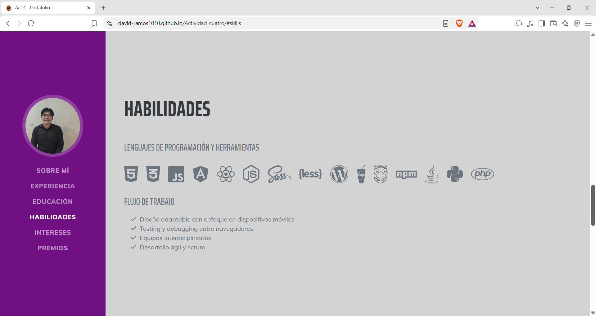
#### Sección de intereses
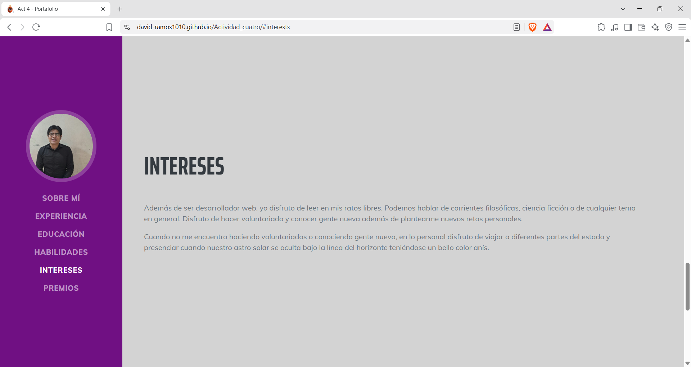
#### Sección de premios y certificaciones


#### Elaborado por: David Efraín José Ramos NL 19
